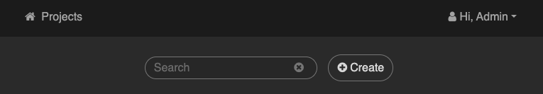
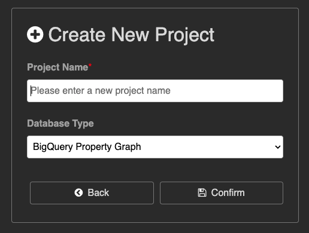
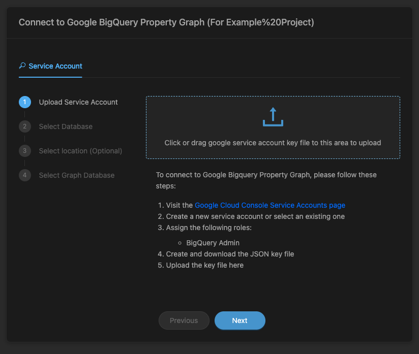
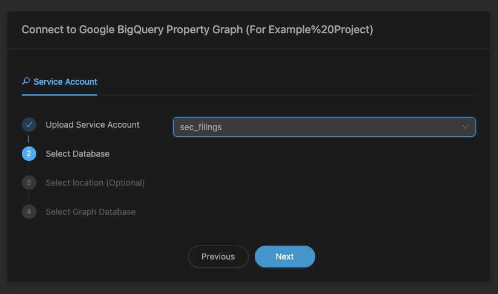
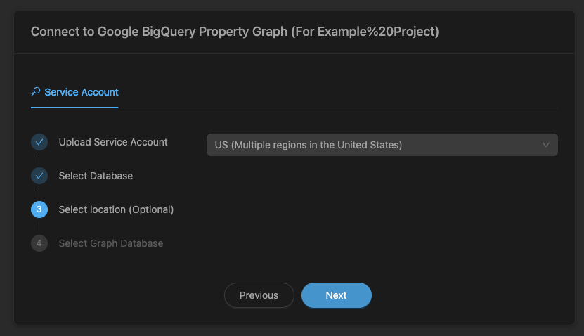
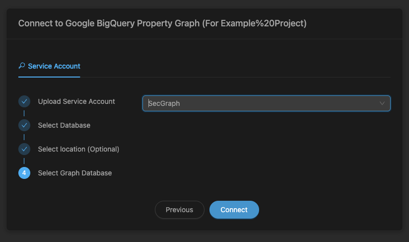

# Connect Kineviz to your own BigQuery graph

> **Kineviz** (formerly **GraphXR**) is Kineviz's graph visualization and analytics
> platform. Some product surfaces — the Google Cloud Marketplace listing, the
> `graphxr.kineviz.com` portal, and screenshots in this repo — still show the former name.
> The screenshots below predate the rename; the steps are unchanged.

**You already have a BigQuery property graph and want to see it in Kineviz.** That's this
page. It takes about ten minutes, most of which is the Desktop download, and it needs no
demo data.

Want a worked example on a real public dataset instead? See [`../demos/`](../demos/).

---

## Before you start

You need four things. The first two are the ones people miss.

**1. A Kineviz account** — [sign up](https://www.kineviz.com/).

Kineviz Desktop is **free for individual use, forever**. There's no trial clock and no
expiry. But the app does require sign-in, so create the account before you download
anything. For team or commercial use, see [Kineviz licensing](https://www.kineviz.com/).

**2. A BigQuery property graph.** Created with `CREATE PROPERTY GRAPH`, in a dataset you can
read. If you don't have one yet, Google's
[Create and query a graph](https://docs.cloud.google.com/bigquery/docs/graph-create) is the
shortest path, or run [`../demos/supply-chain-deps/`](../demos/supply-chain-deps/) which
builds one from a public dataset.

> **BigQuery Graph is pre-GA.** GQL queries require a reservation on the **Enterprise** or
> **Enterprise Plus** edition. On on-demand pricing you can still use `GRAPH_EXPAND`, but not
> the full GQL surface. This is the single most common reason a first connection looks broken
> when it isn't — check it before you debug anything else.

**3. Access.** A Google Cloud account with, at minimum:

| Role | Why |
|---|---|
| [`roles/bigquery.dataViewer`](https://cloud.google.com/bigquery/docs/access-control#bigquery.dataViewer) | Read the tables behind the graph |
| [`roles/bigquery.jobUser`](https://cloud.google.com/bigquery/docs/access-control#bigquery.jobUser) | Run queries |

Those two are enough for read-only use, which is what Kineviz needs in production. You only
need write roles if you're also *creating* graphs.

**4. Room for Desktop** — about 200 MB to download, ~600 MB installed, plus 16 GB RAM.

---

## 1 · Create a service account key

Kineviz Desktop authenticates to BigQuery with a service account key file.

> **Treat the key like a password.** Anyone holding it has whatever access you granted.
> Scope it to the two read-only roles above, keep it out of version control (this repo's
> `.gitignore` and CI both block key files), and delete it when you're done.

**Console**

1. [IAM & Admin → Service Accounts](https://console.cloud.google.com/iam-admin/serviceaccounts)
   → **Create service account**.
2. Name it something you'll recognize later — `kineviz-reader`.
3. Grant it **BigQuery Data Viewer** and **BigQuery Job User**.
4. Open the account → **Keys** → **Add key** → **Create new key** → **JSON**. It downloads.

**gcloud**

```bash
PROJECT_ID=your-project-id

gcloud iam service-accounts create kineviz-reader \
  --project="$PROJECT_ID" \
  --display-name="Kineviz read-only"

for role in roles/bigquery.dataViewer roles/bigquery.jobUser; do
  gcloud projects add-iam-policy-binding "$PROJECT_ID" \
    --member="serviceAccount:kineviz-reader@${PROJECT_ID}.iam.gserviceaccount.com" \
    --role="$role" --condition=None --quiet
done

mkdir -p .gcp && chmod 700 .gcp
gcloud iam service-accounts keys create .gcp/key.json \
  --project="$PROJECT_ID" \
  --iam-account="kineviz-reader@${PROJECT_ID}.iam.gserviceaccount.com"
```

More detail, including key rotation and how to avoid keys entirely on a GCE VM:
[`service-account.md`](service-account.md).

---

## 2 · Install Kineviz Desktop

Download the build for your machine from
[**Releases**](https://github.com/Kineviz/kineviz-desktop/releases) — v0.17.1 or later.

| Platform | File |
|---|---|
| macOS, Apple Silicon | `Kineviz-Desktop-<ver>-mac-arm64.dmg` |
| macOS, Intel | `Kineviz-Desktop-<ver>-mac-x64.dmg` |
| Windows x64 | `Kineviz-Desktop-Setup-<ver>-win-x64.exe` |
| Windows ARM64 | `Kineviz-Desktop-Setup-<ver>-win-arm64.exe` |
| Linux | `Kineviz-Desktop-<ver>-linux-x86_64.AppImage` or the `.deb` |

Not sure which Mac you have: menu → **About This Mac** → **Chip**.

Install, launch, and sign in with the account from *Before you start*.

**Prefer not to install anything, or need the data to stay inside your own GCP project?**
Two alternatives, same connection flow:

- **[GraphXR Explorer for BigQuery](https://console.cloud.google.com/marketplace/product/kineviz-public/graphxr-explorer-for-bigquery)**
  on Google Cloud Marketplace — runs entirely inside your project. The right answer for
  regulated environments.
- **[The hosted portal](https://graphxr.kineviz.com/)** — nothing to install.

---

## 3 · Connect

Two dialogs in Kineviz Desktop: create the project, then a four-step connection wizard.

### Create the project

**1. Click Create New Project**



**2. Enter a Project Name, and set Database Type to `BigQuery Property Graph`** — then
**Confirm**



> Pick **BigQuery Property Graph**, not any other BigQuery entry. The property-graph type is
> what reads a graph created with `CREATE PROPERTY GRAPH`.

### Connect to Google BigQuery Property Graph

The next dialog has a **Service Account** tab with four numbered steps.

**3. Upload Service Account** — the `key.json` from step 1 of this guide



**4. Select Database** — the BigQuery dataset holding your graph, chosen from the dropdown



**5. Select location (Optional)** — pick your dataset's location from the dropdown, shown by
friendly name (`US (Multiple regions in the United States)`, not `us-central1`)



> It is genuinely optional — Kineviz can resolve the location itself. Set it if your dataset
> lives somewhere other than the multi-region default, or if step 6 shows no graphs.

**6. Select Graph Database** — the name from your `CREATE PROPERTY GRAPH` — then **Connect**



The canvas opens. Hit **Search**, pick a node label, and run it to pull your first nodes.

---

## Verify

To check the graph is reachable *before* opening Kineviz — useful when something isn't
working and you want to know which side is at fault:

```bash
./verify.sh --project my-project --dataset my_dataset --graph MyGraph
```

It runs a bounded GQL query and reports the row count. If this passes and Kineviz still
can't see the graph, the problem is the connection settings, not BigQuery.

---

## Troubleshooting

**No graphs listed at step 6 (Select Graph Database)**

Most often the location. Step 5 is optional, so it is easy to skip — but if your dataset is
not in the multi-region default, Kineviz may look in the wrong place. Find your dataset's
location and set it explicitly:

```bash
bq show --format=prettyjson "$PROJECT_ID:$DATASET" | grep location
```

Then match it in the step 5 dropdown, which lists friendly names — `US (Multiple regions in
the United States)` rather than `us-central1`. Failing that, confirm the graph exists at all
with [`verify.sh`](verify.sh).

**Queries fail with a reservation or edition error**

GQL needs an Enterprise or Enterprise Plus reservation while BigQuery Graph is pre-GA. On
on-demand pricing, `GRAPH_EXPAND` works but full GQL doesn't. See
[BigQuery Graph](https://docs.cloud.google.com/bigquery/docs/graph-overview).

**"Permission denied" with a valid key**

The key's service account needs the roles on the *project that owns the dataset*, which
isn't always the project you created the key in.

```bash
gcloud projects get-iam-policy "$PROJECT_ID" \
  --flatten="bindings[].members" \
  --filter="bindings.members:kineviz-reader@${PROJECT_ID}.iam.gserviceaccount.com" \
  --format="table(bindings.role)"
```

**The dataset list is empty after uploading the key**

Usually `roles/bigquery.jobUser` is missing — listing datasets requires running a job.

**Desktop won't sign in**

An account is required, and it's free for individual use.
[Sign up](https://www.kineviz.com/), then sign in.

**Still stuck?** [Open an issue](https://github.com/Kineviz/bigquery-kineviz-examples/issues/new?template=demo-bug.yml) with the error and
your Desktop version. Please redact project IDs and never paste a key.

---

## What's next

- [`../demos/`](../demos/) — worked examples on public datasets
- [Google's BigQuery Graph docs](https://docs.cloud.google.com/bigquery/docs/graph-overview)
- [`spanner-kineviz-examples`](https://github.com/Kineviz/spanner-kineviz-examples) ·
  [`alloydb-kineviz-examples`](https://github.com/Kineviz/alloydb-kineviz-examples)
