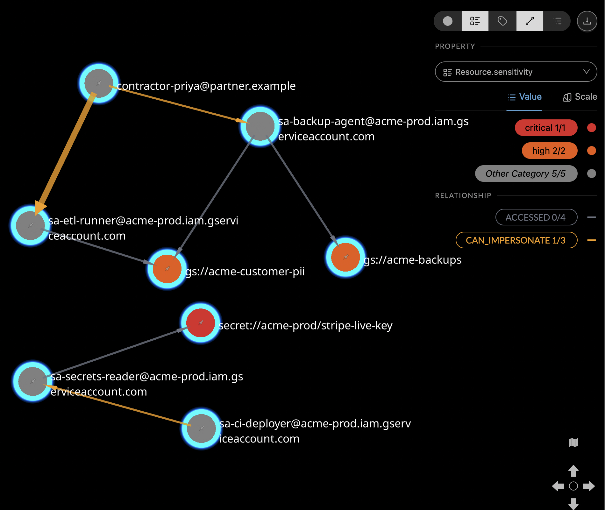

# BigQuery Graph + Kineviz: privilege escalation paths in audit logs

> **Kineviz** (formerly **GraphXR**) is Kineviz's graph visualization and analytics
> platform. Some product surfaces — the Google Cloud Marketplace listing, the
> `graphxr.kineviz.com` portal, and screenshots in this repo — still show the former name.

## What you'll build

A property graph of Cloud Audit Log records — principals, the resources they touch, and who
can impersonate whom. Then you use it to answer the question a list of IAM grants cannot:
**who can reach sensitive data by going through something else?**

In this dataset only three principals touch sensitive resources directly, and all three are
service accounts. Every other route to that data is an escalation path, and the graph finds
them in one query.

<!-- TODO: hero screenshot of an escalation path on the Kineviz canvas -> img/hero.png -->

## At a glance

| | |
|---|---|
| **Backend** | BigQuery Graph |
| **Status** | Pre-GA — GQL verified working on on-demand pricing ([details](../../docs/PREVIEW_NOTES.md)) |
| **Connection** | Kineviz Desktop → BigQuery Property Graph ([how](../../connect/)) |
| **Dataset** | Synthetic, generated locally — no public dataset, nothing to download |
| **Time** | ~10 minutes |
| **Cost** | ~$0.01 — the data is a few MB and lives in your project |
| **You need** | A Kineviz account (free for individual use, forever), a GCP project with billing enabled |

> **The data is synthetic on purpose.** Real audit logs are the most sensitive data most
> organizations hold, so a public example repo should neither ship them nor ask you to point
> a first run at yours. The schema mirrors the fields that matter in
> `cloudaudit_googleapis_com_activity`, so the graph model and every query here transfer
> directly to real logs — swap the source table and the rest works unchanged.

## Architecture

```
        Kineviz Desktop
              │
              │  BigQuery Property Graph
              ▼
   AuditGraph  (CREATE PROPERTY GRAPH)
              │
              ▼
   nodes_principal · nodes_resource      ← in YOUR project
   edges_accessed  · edges_can_impersonate
              │
              ▼
   raw_principals · raw_impersonations · raw_events
              │
              │  seeded generator, no network
              ▼
   data/generate.py                      ← synthetic, reproducible
```

## Prerequisites

1. **A Kineviz account** — [sign up](https://www.kineviz.com/). Kineviz Desktop is **free
   for individual use, forever**, but the app requires sign-in. Do this first.
2. **Kineviz Desktop v0.17.1+** —
   [releases](https://github.com/Kineviz/kineviz-desktop/releases). ~600 MB installed,
   16 GB RAM.
3. **A Google Cloud project** with billing enabled and these roles on your account:
   - [`roles/bigquery.jobUser`](https://cloud.google.com/bigquery/docs/access-control#bigquery.jobUser) — run queries
   - [`roles/bigquery.dataEditor`](https://cloud.google.com/bigquery/docs/access-control#bigquery.dataEditor) — create the demo dataset
4. **`gcloud`, `bq`, and Python 3.9+** — [install the SDK](https://cloud.google.com/sdk/docs/install).

   No BigQuery reservation is needed: GQL was verified working on on-demand pricing on
   2026-08-13.

## Quick start

```bash
cp .env.example .env      # set GCP_PROJECT
../../gxr up cloud-audit-access
```

This is the cheapest and fastest demo in the repo — nothing reads a public dataset.

## Or do it step by step

**1. Check prerequisites.** Creates nothing.

```bash
./scripts/preflight.sh
```

**2. Generate the logs.** Seeded, so the same numbers always produce the same graph —
including the escalation paths the queries find.

```bash
set -a; . .env; set +a
python3 data/generate.py --out data/generated --seed "$AUDIT_SEED" \
  --days "$AUDIT_DAYS" --principals "$AUDIT_PRINCIPALS" --events "$AUDIT_EVENTS"
```

It prints the findings it planted, so you know what the queries should surface.

**3. Create the dataset and load the logs.**

```bash
bq --project_id="$GCP_PROJECT" mk --dataset --location="$BQ_LOCATION" \
   "$GCP_PROJECT:$BQ_DATASET"

for t in principals impersonations events; do
  bq --project_id="$GCP_PROJECT" load --replace \
     --source_format=NEWLINE_DELIMITED_JSON --autodetect \
     "$GCP_PROJECT:$BQ_DATASET.raw_$t" "data/generated/$t.ndjson"
done
```

**4. Shape the node and edge tables.**

```bash
sed -e "s|\${PROJECT}|$GCP_PROJECT|g" -e "s|\${DATASET}|$BQ_DATASET|g" \
    sql/01_build_tables.sql \
  | bq query --project_id="$GCP_PROJECT" --use_legacy_sql=false \
      --maximum_bytes_billed="$MAX_BYTES_BILLED"
```

[`sql/01_build_tables.sql`](sql/01_build_tables.sql) aggregates 6,000 log lines into one
edge per principal/resource pair — the graph you can actually read.

**5. Create the property graph.**

```bash
sed -e "s|\${PROJECT}|$GCP_PROJECT|g" -e "s|\${DATASET}|$BQ_DATASET|g" \
    -e "s|\${GRAPH}|$BQ_GRAPH|g" sql/02_property_graph.sql \
  | bq query --project_id="$GCP_PROJECT" --use_legacy_sql=false
```

**6. Verify.**

```bash
./scripts/verify.sh
```

This runs the demo's *headline* query rather than a trivial smoke test. If no escalation
paths come back, the graph technically works but the demo is pointless — so that counts as a
failure here.

## Connect Kineviz

The walkthrough with screenshots is in **[`connect/`](../../connect/)** — the same flow for
every demo here, so it's documented once.

Values for this demo:

| Field | Value |
|---|---|
| Database Type | `BigQuery Property Graph` |
| Upload Service Account | your service account JSON ([how to make one](../../connect/service-account.md)) |
| Select Database | `kineviz_audit_demo` |
| Select location (Optional) | your `BQ_LOCATION` (default `US`) |
| Select Graph Database | `AuditGraph` |

## Explore

Four questions, in [`queries/`](queries/). **Start with `01`** — it's the query this demo
exists for.

The GQL below is the **canvas** form: it ends in `RETURN *`, so the matched subgraph lands on
the Kineviz canvas as nodes and edges instead of coming back as a table. Paste it into the
Query panel and hit Run — the panel already knows which graph you're connected to, so these
start straight at `MATCH`. Each question also ships a table version in
[`queries/`](queries/), which does need a `GRAPH` line because `bq` has no such context.

**1. Who reaches sensitive data only by impersonation?** —
[`01-escalationpaths.canvas.gql`](queries/01-escalationpaths.canvas.gql)

```sql
MATCH (actor:Principal)-[ci:CAN_IMPERSONATE]->(proxy:Principal)-[a:ACCESSED]->(r:Resource)
WHERE r.sensitivity IN ('high', 'critical')
  AND a.success_count > 0
RETURN *
```

Principals that touch nothing sensitive directly but reach it through something that can. An
access review built on direct grants shows these people as harmless.

The table version adds a `NOT EXISTS` block excluding actors who already hold direct sensitive
access. The canvas translator doesn't take subqueries, so the canvas form leaves it out — on
this seeded dataset that changes nothing, because the three principals with direct sensitive
access (`sa-etl-runner@`, `sa-secrets-reader@`, `sa-backup-agent@`) never appear as
impersonation actors. Run [`01-escalation-paths.gql`](queries/01-escalation-paths.gql) when
you need the exact semantics.



Resources are coloured by `sensitivity` — red for `critical`, orange for `high` — and the
orange edges are `CAN_IMPERSONATE`, the grey ones `ACCESSED`. That colouring is what makes the
finding legible: every principal in the picture is grey, so nobody holds direct access to
anything sensitive. The reach is entirely in the orange edges.

Two shapes stand out. `contractor-priya@partner.example` arrives at
`gs://acme-customer-pii` twice, once via `sa-etl-runner@` and once via `sa-backup-agent@` —
revoke either grant on its own and the path survives. And along the bottom,
`sa-ci-deployer@` → `sa-secrets-reader@` → `secret://acme-prod/stripe-live-key` is a chain
with no human anywhere in it, which is why a user access review never surfaces it.

**2. One principal's blast radius** —
[`02-blastradius.canvas.gql`](queries/02-blastradius.canvas.gql)

**This is the one to run in Kineviz rather than the CLI.** "How far does this account actually
reach" is a shape, and "should we offboard this contractor first" is usually obvious on sight.

Run the three blocks **separately**. The canvas accumulates results, so the union of the three
runs is the blast radius — one block per impersonation depth.

```sql
-- Block 1 · direct access, no impersonation
MATCH (start:Principal)-[a:ACCESSED]->(r:Resource)
WHERE start.name = 'contractor-priya@partner.example'
  AND a.success_count > 0
RETURN *

-- Block 2 · one impersonation hop
MATCH (start:Principal)-[ci1:CAN_IMPERSONATE]->(v1:Principal)-[a:ACCESSED]->(r:Resource)
WHERE start.name = 'contractor-priya@partner.example'
  AND a.success_count > 0
RETURN *

-- Block 3 · two impersonation hops
MATCH (start:Principal)-[ci1:CAN_IMPERSONATE]->(v1:Principal)-[ci2:CAN_IMPERSONATE]->(v2:Principal)-[a:ACCESSED]->(r:Resource)
WHERE start.name = 'contractor-priya@partner.example'
  AND a.success_count > 0
RETURN *
```

Swap the name for anyone from question 1.

**Block 3 returns nothing for `contractor-priya@partner.example`, and that is the correct
answer** — she reaches everything in a single impersonation hop, so there is no two-hop
pattern to match. Her blast radius is entirely in blocks 1 and 2. The same is true of
`sa-ci-deployer@`: its route to `secret://acme-prod/stripe-live-key` is one hop through
`sa-secrets-reader@`, not two.

The only two-hop chains in this dataset belong to `aisha@acme.example` and
`james@acme.example`, both through `marcus@acme.example` and out to `grace@` or `tom@`. Use
one of those names to see block 3 return something:

```sql
MATCH (start:Principal)-[ci1:CAN_IMPERSONATE]->(v1:Principal)-[ci2:CAN_IMPERSONATE]->(v2:Principal)-[a:ACCESSED]->(r:Resource)
WHERE start.name = 'aisha@acme.example'
  AND a.success_count > 0
RETURN *
```

Worth noticing what comes back: those chains reach only `low` and `medium` resources —
`bq://acme-prod.billing`, `gs://acme-analytics-export`, `bq://acme-prod.telemetry`. Nothing
sensitive is two hops away in this dataset. The escalation risk is all in the one-hop paths,
which is why question 1 finds it without needing depth.

**3. Resources reachable by more than one route** —
[`03-redundantpaths.canvas.gql`](queries/03-redundantpaths.canvas.gql)

The finding a spreadsheet can't produce. Revoking one grant feels like remediation; if a
second path exists, nothing changed.

```sql
MATCH (actor:Principal)-[ci1:CAN_IMPERSONATE]->(p1:Principal)-[a1:ACCESSED]->(r:Resource),
      (actor)-[ci2:CAN_IMPERSONATE]->(p2:Principal)-[a2:ACCESSED]->(r)
WHERE p1.id <> p2.id
  AND r.sensitivity IN ('high', 'critical')
  AND a1.success_count > 0
  AND a2.success_count > 0
RETURN *
```

Two comma-joined patterns from the same actor to the same resource through two *different*
proxies. Any match is at least two distinct routes, and both routes get drawn — which is the
advantage over the table version's count.

**4. Who's accumulating denials?** —
[`04-deniedprobing.canvas.gql`](queries/04-deniedprobing.canvas.gql)

Usually a broken job. Sometimes someone finding out what they can reach.

```sql
MATCH (p:Principal)-[a:ACCESSED]->(r:Resource)
WHERE a.denied_count > 0
RETURN *
```

Every principal→resource edge carrying denials. The pattern the table can only count is
visible directly here: denials fanned across many resources reads as probing, many against one
reads as a broken job. Read `denied_count` on the edges.

### What you should find

Seeded, so these are reproducible rather than lucky:

- **`dana@acme.example`** holds only viewer-tier roles, but impersonates `sa-etl-runner@`
  and through it reads `gs://acme-customer-pii`.
- **`sa-ci-deployer@` → `sa-secrets-reader@` → `secret://acme-prod/stripe-live-key`** — a
  service-account chain with no human in it, so it never appears in a user access review.
- **`contractor-priya@partner.example`** reaches `gs://acme-customer-pii` through *two*
  different service accounts. Revoking one changes nothing.

## How the graph is modeled

| Node label | Source table | Key | Properties |
|---|---|---|---|
| `Principal` | `nodes_principal` | `id` (email) | `name`, `principal_type`, `roles`, `successful_calls`, `denied_calls` |
| `Resource` | `nodes_resource` | `id` (URI) | `name`, `resource_type`, `sensitivity`, `access_count` |

| Edge label | From → To | Source table | Properties |
|---|---|---|---|
| `ACCESSED` | `Principal` → `Resource` | `edges_accessed` | `call_count`, `denied_count`, `methods`, `max_severity_tier`, `first_seen`, `last_seen` |
| `CAN_IMPERSONATE` | `Principal` → `Principal` | `edges_can_impersonate` | `grant_type` |

`CAN_IMPERSONATE` is the edge that does the work. Without it this is a list of who touched
what; with it, reachability becomes a graph problem.

### Pointing this at real logs

Replace `raw_events` with your audit log sink and map four fields —
`protopayload_auditlog.authenticationInfo.principalEmail`, `methodName`, `resourceName`, and
the status — then derive `sensitivity` from your own resource labels. The impersonation
edges come from `iam.serviceAccounts.getAccessToken` calls in the same logs.

## Troubleshooting

**`verify.sh` reports no escalation paths**

Shouldn't happen — the data is seeded. If it does, `data/generate.py` and the demo have
drifted apart. Open an issue; that's a bug, not a configuration problem.

**The load step fails on schema autodetection**

Delete `data/generated/` and re-run setup. A partially written NDJSON file confuses
autodetect.

**A reservation or edition error**

Uncommon — GQL was verified working on on-demand pricing. See
[`docs/PREVIEW_NOTES.md`](../../docs/PREVIEW_NOTES.md) if you hit it.

**Everything looks suspicious**

It's synthetic. `acme.example` and `partner.example` are reserved example domains, and none
of the principals, resources, or secrets are real.

## Clean up

```bash
../../gxr down cloud-audit-access
```

Or by hand:

```bash
bq --project_id="$GCP_PROJECT" rm -r -f --dataset "$GCP_PROJECT:$BQ_DATASET"
rm -rf data/generated
```

Your Kineviz project is separate — delete it in Kineviz Desktop if you no longer want it.

## What's next

- [`supply-chain-deps`](../supply-chain-deps/) — dependency risk on deps.dev
- [`ethereum-flows`](../ethereum-flows/) — tracing value through Ethereum
- [`connect/`](../../connect/) — point Kineviz at your own BigQuery graph
